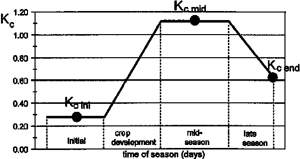

# SOC
SOC LEAF are generated following the methods described in [Morais, Teixeria & Domingos (2019)](https://doi.org/10.1371/journal.pone.0222604) and [Teixeira, Morais & Domingos (2021)](https://doi.org/10.1038/s41597-021-01018-2), these in turn use the Rothmadel C (RothC) model to simulate SOC changes through time. RothC simulates "the turnover of organic carbon in non-waterlogged top-soils that allows for the effects of soil type, temperature, moisture content and plant cover on the turnover process" (reference). Complete documentation can be found on LINK.

The model has been adaptaed into GIS format, using as a base the one found on XXX.

## Step 1 - Data Gathering and Processing
The model needs several inputs, despite being the most simple, that ara availalbe globally. All data is location specific.

### Soil and Weather Data
Weather related data has been obtained from NASA projects, while soil related data has been sourced from SoilGrids. A data download support script is availalbe in XXX.

#### 1) Monthly Precipitation (mm/month)
For the newly generated practice change LEAFs, [NASA's GPM_3IMERGM](https://disc.gsfc.nasa.gov/datasets/GPM_3IMERGM_07/summary?keywords=3IMERG) data, between 2013 and 2023 and given at 0.1°, has been used.

#### 2) Temperature (mm)
For the newly generated practice change LEAFs, [GLDAS Catchment Land Surface Model L4](https://disc.gsfc.nasa.gov/datasets/GLDAS_CLSM10_M_2.1/summary), monthly 1.0 x 1.0 degree V2.1 (GLDAS_CLSM10_M), at a 1° resolution has been used.

#### 3) Soil Organic Carbon (t C/ha)
Organic Carbon Stock (0-30 cm) mean has been used. [link](https://files.isric.org/soilgrids/latest/data/ocs/) 

#### 4) Clay Content (percentage)
Average clay content (15-30 cm) has beeb used. [link](https://files.isric.org/soilgrids/latest/data/clay/) 

#### 5) Sand Content, only needed for reduced tillage (percentage)
Average sand content (15-30 cm) has beeb used. [link](https://files.isric.org/soilgrids/latest/data/sand/)

### Crop Related Data

#### 6) DPM/RPM ratio
According to XXX...
For most agricultural crops and improved grassland, we use a DPM/RPM ratio of 1.44 i.e., 59% of the plant material is DPM and 41% is RPM. For unimproved grassland and scrub (including Savanna) a ratio of 0.67 is used. For a deciduous or tropical woodland, a DPM/RPM ratio of 0.25 is used, so 
20% is DPM and 80% is RPM.

#### 7) Depth soil layer sampled (cm)
15 cm as default, due to the 0-30 cm SoilGrids data.

#### 7) Growing location
Specic location or map with locations for the commodity under study. For baseline and newly developed LEAF, maps were sourced from [Morais, Teixeria & Domingos (2019)](https://doi.org/10.1371/journal.pone.0222604), which divided the globe into UHTH zones of X by Y resolution.

#### 8) Soil Cover 
Factor dependent if the soil is bare or not that month on a given location for each commodity. 
If bare, 1, if not, 0.6

#### 9) Commodity Yield (t/ha)
Yield specific for each commodity in a given location. Not an specific input into RothC, but used to calculate monthly plant residue input. It has been differentiated between rainfed or irrigated for crops. 

For the available LEAFs, an average yield between 2013 and 2023 was calculated using 2 sources: FAOstats and [SPAM](https://www.mapspam.info/) v2 2020 yields. Spam yields are given for rainfed crops, irrigated crops, and crops and irrigated crops together.

The following procedure was use to assign yields into each UHTH:
1) An average per country for each crop was calculated using FAOstats, as well as a ratio between the average and 2020 reported yields (yld_ratio).
2) An average SPAM yield was calculated for the 3 available datasets, and then multiplied by FAOstats' yld_ratio. A ratio between all irrigation practices to rainfed and irrigated is then also calculated for each UHTH and globally. 
3) For each UHTH zone where the crop can be grown, the adjusted SPAM yields are assigned if available. If not, the average country FAOstat yield adjusted by irrigation practice is assigned. 
4) If neither FAOstats or SPAM have available data, an average per ecoregion and Biome of the currently calcualted yields is assigned on each UHTH in that order. 
5) Finally, for all remaining zones without a yield, a nearest neighbour value is assigned. 

This has been implemented in the script cropcalcs under the function create_crop_yield_raster_withIrrigationPracticeScaling

#### 8)  Monthly input of plant residues (t C/ha)
Calculated for each crop depending on their yield for a given location. Commodity yields are transformed into dry matter content using table 1. A carbon content of 50% was used as average. PET's crop coefficient $(K_c)$ curves is then used to distribute annual plant residues into each month by multiplying by $K_{c,t}/\sum_{t=1}^{12} K_{c,t}$

Morais, Teixeria & Domingos (2019) calculated plant residues using IPCC's methods described in 1997 and 2006 guidelines. More recent guidelines from 2017 provides updated guidelines on this [link](https://www.ipcc-nggip.iges.or.jp/public/2019rf/pdf/4_Volume4/19R_V4_Ch11_Soils_N2O_CO2.pdf) and is found starting on Equation 11.6

Basically, residues are calcualted as residues above ground (AG) plus residues below ground (BG):
    Res = AG + BG

#### Above ground residues
This is calculated as:
$AG(T) = Crop(T) * R_{AG}$

Where $R_{AG}$ is ratio of above-ground residue dry matter to harvested yield for crop T (Crop (T)), kg d.m. ha-1 (kg d.m. ha-1 )-1 , (Table 11.1a). Crop(T) is defined as  Yield(T) * DRY(T) and DRY(T) is the crop dry matter content.

It can be, more specifically, calculated as:
$AG(T) = Crop(T) • Slope(T) + Intercept(T)$

#### Below ground residues (BG)
They're calculated as:
$BG(T) = (Crop(T) + AG(T)) * RS(T)$

Where RS(T) is ratio of below-ground root biomass to above-ground shoot biomass for crop T, kg d.m.ha-1 (kg d.m. ha-1 ) -1 

##### Table 1
|Crop|Dry|Slope|Intercept|RS|
|:---|---|-----|---------|--|
|Barley|0.89|0.98|0.59|0.22|
|Seed cotton, unginned"|0.85|1.07|0.85|0.19|
|Maize (corn)|0.87|1.03|0.61|0.22|
|Rape or colza seed|0.85|1.13|0.85|0.19|
|Sorghum|0.89|0.88|1.33|0.22|
|Soya beans|0.91|0.93|1.35|0.19|
|Sunflower seed|0.85|1.13|0.85|0.19|
|Wheat|0.89|1.51|0.52|0.23|

#### 9) Monthly input of farmyard manure (FYM) (t C/ha)

#### 10)  Monthly open pan evaporation (mm/month)
Crop and location dependent open pan evaporation. According to XXX, Rainfall and open-pan evaporation are used to calculate topsoil 
moisture deficit (TSMD), as it is easier to do this than obtain monthly measurements of the actual topsoil water deficit. To calculate this for each crop and location, several steps are needed.

All the methods used can be found under the PET script.

##### Potential Evapotranspiration - Location based
PET is calculated using the Thornthwaite equation ([Thornthwaite (1948)](https://doi.org/10.2307/210739)) for each month. This equation calculates PET based on duration of sunlight in hours (L), varying with months and latitude, number of days in a month (N), average monttly air temperature (T, in °C), and heat index (I). Detailed explanations can be found [here](https://wikifire.wsl.ch/tiki-indexf125.html?page=Potential+evapotranspiration)

PET is calculated as:

$\text{PET} =
\begin{cases}
0, & T < 0 \\
1.6 \cdot \dfrac{L}{12} \cdot \dfrac{N}{30} \cdot \left(\dfrac{10T}{I}\right)^{a}, & T \geq 0
\end{cases}$

Where a is calcualted as:

$a = (6.75 \times 10^{-7} \cdot I^{3}) - (7.71 \times 10^{-5} \cdot I^{2}) + (0.01792 \cdot I) + 0.49239$

And I is calculated as

$I = \sum_{i=1}^{n} (T_i/5)^{1.514}$ for all month temperatures above 0 °C

###### Sunlight duration (L)
Sunlight duration (L) is then calculated using the solar hour angle (ω₀) and then transformed into hours of the day. 
$\omega_0$ can be calculated using the following equation:

$cos(\omega_0) = - tan (\phi) * tan(\delta)$

Where $\phi$ is the latitude and $\delta$ is the average sun declination for each month, both in radians

$\delta$ can be estimated using Cooper's equation (below) nad then transformed into radians:

$\delta = 23.44^\circ \cdot \sin\!\left(\frac{360^\circ}{365}(n - 81)\right)$

Where $n$ is the day of the year (1-365). The middle day of each month is taken,

Finally, the average monthly of hours in a day can then be calculated using:

$L = (2\omega_0 \cdot (180/\pi)) /15$

$\omega_0$ is the angle between local noon and either sunrise or sunset, thus multiplying by 2 gives the total angular span of the Sun above the horizon (morning + afternoon). $180/\pi$ transforms radians into degrees, and 15° represents 1 hour.

##### Potential Crop Evapotranspiration
To adapt the location based PET to each crop, it needs to be multiplied by the crop coefficient $(K_c)$ during each month. A $(K_c)$ monthly curve is thus created to calculate monthly crop evapotranspiration. Complete documentation can be found in [Source: Allen et al. (1998)](https://www.fao.org/4/X0490E/x0490e00.htm).

Source: Allen et al. (1998)

$K_c$ values $K_{c, ini}$, $K_{c, mid}$, $K_{c, lat}$ as well as the duration of each period are defined for each crop per thermal zone in Table 5 of Morais, Teixeria & Domingos (2019) supplementary materials.

## Step 2 - Data Harmonization
Once all data has been downloaded and inputs calculated, everything needs to be brought into the same base map format for GIS calculations. For the LEAFs available in this repository, UHTH zones from Morais, Teixeria & Domingos (2019) have been used as the base layer.

## Step 3 - 