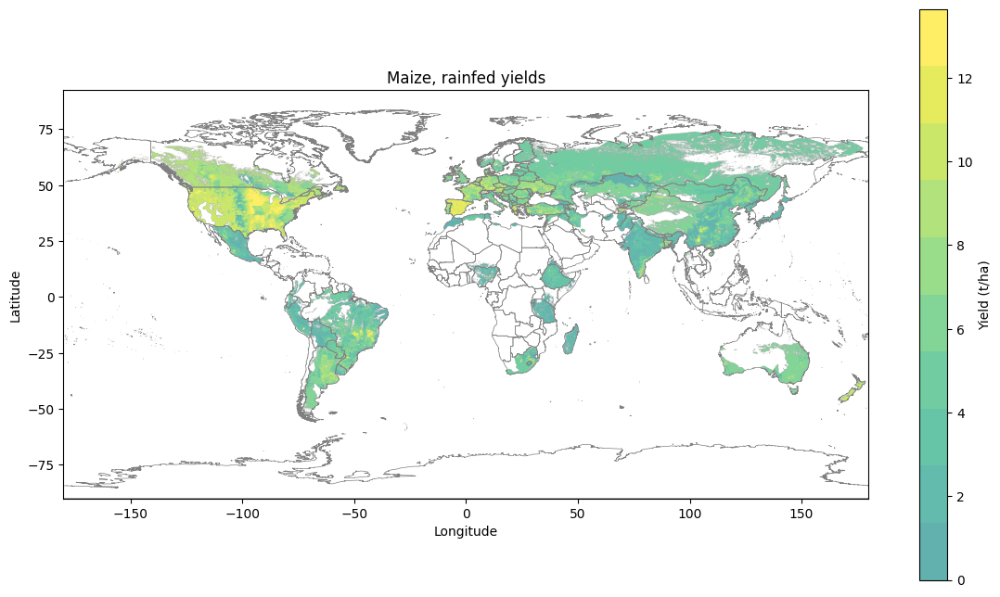
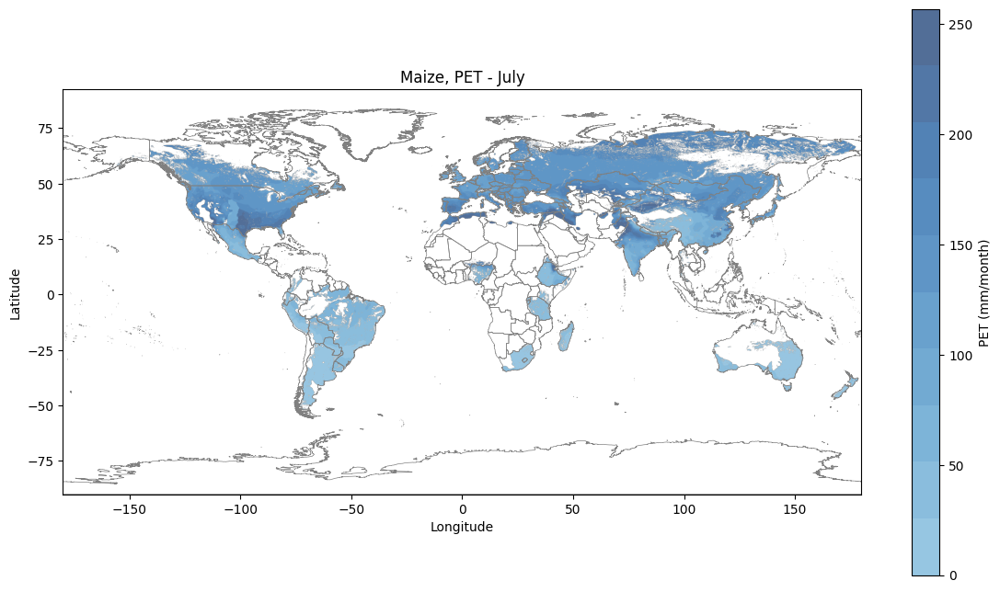
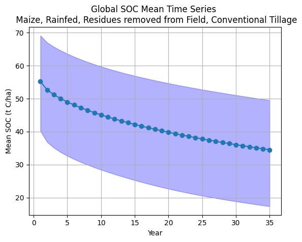
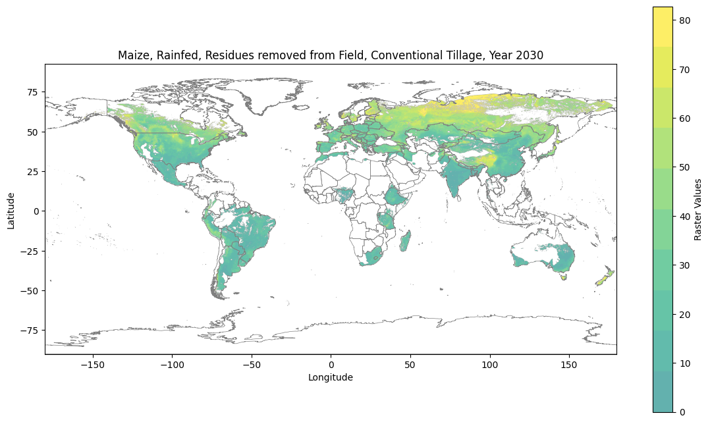
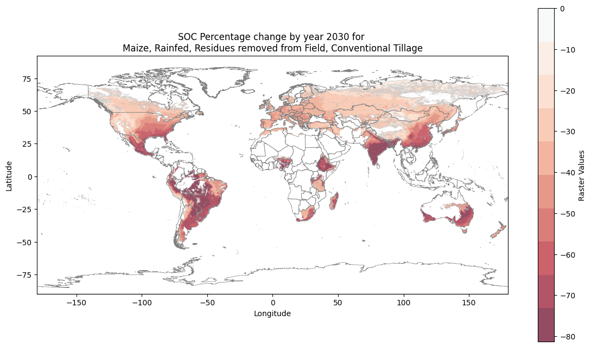

# SOC LEAF Example
In this example, SOC LEAF for Maize, rainfed, plant residues removed, traditional tillage production will be developed for a 2030 and 2050 scenario. The process assumes that the land use is kept the same, and that weather and crop data do not change over time, generating LEAF for the inputted land use map using the default values previously mentioned on [SOC Documentation](SOC_Documentation.md). 

A similar approach can be implemented with a different land use map and/or using primary data regarding yields, plant cover, plant residues, soil and weather data. The methods can be changed to simulate crop rotations, organic ammendments, multi-crop systems, among others.

## Data Download and Processing
As explained in SOC Documentation, several data layers need to be downloaded first. This examples uses all potential locations where maize could be grown under rainfed conditions, according to FAO GAEZ (LOOK FOR LINK) vXXX.

### Soil & Weather
Precipitation and air temperature, in Celsius, have been downloaded and processed and can be found under [data/soil_weather](data/soil_weather). SoilGrids data has only been downloaded and processed into UHTH zones in the needed format and is also available in the same folder.

### Crop Data
Output from package installation has been omitted for brevity; ensure the required packages are installed in your environment (see the pip command above).
    Requirement already satisfied: certifi in c:\users\loyola\onedrive - world wildlife fund, inc\documents\203. python projects\sbtn_test\.venv\lib\site-packages (from rasterio) (2025.8.3)
    Requirement already satisfied: click>=4.0 in c:\users\loyola\onedrive - world wildlife fund, inc\documents\203. python projects\sbtn_test\.venv\lib\site-packages (from rasterio) (8.3.0)
    Requirement already satisfied: cligj>=0.5 in c:\users\loyola\onedrive - world wildlife fund, inc\documents\203. python projects\sbtn_test\.venv\lib\site-packages (from rasterio) (0.7.2)
    Requirement already satisfied: click-plugins in c:\users\loyola\onedrive - world wildlife fund, inc\documents\203. python projects\sbtn_test\.venv\lib\site-packages (from rasterio) (1.1.1.2)
    Requirement already satisfied: colorama in c:\users\loyola\onedrive - world wildlife fund, inc\documents\203. python projects\sbtn_test\.venv\lib\site-packages (from tqdm) (0.4.6)
    Requirement already satisfied: narwhals>=1.15.1 in c:\users\loyola\onedrive - world wildlife fund, inc\documents\203. python projects\sbtn_test\.venv\lib\site-packages (from plotly) (2.5.0)
    Requirement already satisfied: six>=1.5 in c:\users\loyola\onedrive - world wildlife fund, inc\documents\203. python projects\sbtn_test\.venv\lib\site-packages (from python-dateutil>=2.7->matplotlib) (1.17.0)
    

    
    [notice] A new release of pip is available: 24.3.1 -> 25.2
    [notice] To update, run: python.exe -m pip install --upgrade pip
    


```python
# Modules importing
import polars as pl
import matplotlib.pyplot as plt
import importlib
import os
import pandas as pd

import leaf_utils.RothC_Raster as rothC
import leaf_utils.cropcalcs as cropcalcs
import leaf_utils.map_plotting as mplot

def reload_cropcalcs():
    importlib.reload(cropcalcs)

def reload_rothC():
    importlib.reload(rothC)

def reload_mplot():
    importlib.reload(mplot)
```

Now the rest of the data can be prepared to calculate new LEAFs. The cropcals.prepare_crop_data() function automatize the creation of yields maps, monthly plant cover, monthly PET, monthly irrigation, and monthly plant residue. All this inputs can be changed to reflect primary data.

Before running the function, the following fields should be defined:


```python
lu_filepath = "data/example/Maize_rf_lu.tif"
spam_maize_all = "data/crops/spam2020V2r0_global_yield/spam2020_V2r0_global_Y_MAIZ_A.tif"
spam_maize_irr = "data/crops/spam2020V2r0_global_yield/spam2020_V2r0_global_Y_MAIZ_I.tif"
spam_maize_rain = "data/crops/spam2020V2r0_global_yield/spam2020_V2r0_global_Y_MAIZ_R.tif"
output_folder = "data/example"
```

Now preparing the remaining RothC inputs for Maize, rainfed. If this example has already been run, the function will skip generating the needed files. This should take a couple of minutes.


```python
cropcalcs.prepare_crop_data(
    crop_name = "Maize",
    crop_practice_string = "rf",
    lu_data_path = lu_filepath,
    spam_crop_raster = spam_maize_rain,
    output_data_folder = output_folder,
    irr_yield_scaling = "rf",
    spam_all_fp = spam_maize_all,
    spam_irr_fp = spam_maize_irr,
    spam_rf_fp = spam_maize_rain
)
```

    Land use binary raster already exist. Skipping...
    PET raster already exists — skipping computation.
    Irrigation raster already exists — skipping computation.
    Creating Maize (corn) shapefile...
    Creating yield raster...
    Average irrigated ratio: 1.7520839058709115
    Average rainfed ratio: 0.9714865494249993
      → Applying rainfed scaling to all‐SPAM yields…
    Yield raster written to data/example/Maize_rf_yield_monthly.tif
    Creating plant cover raster...
    Creating plant residue raster...
    All data created for Maize, rf!!!
    

### Inspecting outputs
Inspecting the yield data results.


```python
maize_rf_yields = "data/example/Maize_rf_yield.tif"
```


```python
mplot.plot_raster_on_world_extremes_cutoff(
    tif_path=maize_rf_yields,
    title="Maize, rainfed yields",
    label_title="Yield (t/ha)",
    quantiles=10
)
```

    Raster has 82,695 different values. Min: 0.20. Max: 13.65
    Using quantiles
    All positives route
    


    

    


Maize PET - Monthly


```python
maize_pet_monthly = "data/example/Maize_pet_monthly.tif"
```


```python
mplot.plot_raster_on_world_extremes_cutoff(
    tif_path=maize_pet_monthly,
    title="Maize, PET - July",
    raster_band=7,
    label_title="PET (mm/month)",
    quantiles=10,
    cmap="Blues"
)
```

    Raster has 993,711 different values. Min: 0.00. Max: 256.88
    Using quantiles
    All positives route
    


    

    


## RothC Modelling
With all data generated, the RothC model can be run. SoilGrids SOC most data is from 2016, so in order to generate 2030 and 2050 maps aligned with SBTi's short and long-term targets, two LEAF will be generated: 34 and 54 years. Further, in this case, plant residues will be removed from the field, and traditional tillage applied.

Defining the needed additional inputs:


```python
evap = "data/example/Maize_pet_monthly.tif"
pc = "data/example/Maize_pc_monthly.tif"
leaf_output_folder = "LEAFs/example"
```

Now running the RothC model. Depending on the amount of years and land modelled, this could take from a few minutes to 1+ hours.

Running for 2030 scenario 


```python
reload_rothC()
```


```python
leaf_maize_rf_resoff_ct_2030 = rothC.run_RothC(
    crop_name = "Maize",
    practices_string_id= "rf_resoff_ct",
    n_years = 34,
    save_folder = leaf_output_folder,
    data_description = "RothC model results after 34 years for Maize, rainfed, residues removed from field, conventional tillage",
    lu_fp = lu_filepath,
    evap_fp = evap,
    pc_fp = pc
)
```

    Loading environmental data...
    Loading crop data...
    Running RothC...
    

    RuntimeWarning: overflow encountered in exp (origin: RothC_Core.py:56)
    RothC months: 100%|██████████| 408/408 [17:44<00:00,  2.61s/it]
    

#### Checking results
Now that results have been generated, they can be inspected.


```python
leaf_maize_rf_resoff_ct_2030_tif = "LEAFs/example/Maize_rf_resoff_ct_34y_SOC.tif"
```

Checking the properties of the raster...


```python
mplot.inspect_raster(leaf_maize_rf_resoff_ct_2030_tif)
```

    File: LEAFs/example/Maize_rf_resoff_ct_34y_SOC.tif
    Driver: GTiff
    Width, Height: 4320, 2083
    Number of Bands: 35
    CRS: EPSG:4326
    Bounds: BoundingBox(left=-179.99999999999997, bottom=-89.99999999999994, right=179.99999999999991, top=83.58333333333331)
    Pixel Size: (0.0833333333333333, 0.0833333333333333)
    No-data Value: nan
    
    --- Raster Metadata ---
    description: RothC model results after 34 years for Maize, rainfed, residues removed from field, conventional tillage
    long_name: Soil Organic Carbon
    model: RothC rasterized vectorized
    units: t C/ha
    AREA_OR_POINT: Area
    
    --- Band Information ---
    
    Band 1:
      Data Type: float32
      Min Value: 6.81576681137085
      Max Value: 166.87579345703125
      Mean Value: 55.2380485534668
      Standard Deviation: 20.117786407470703
    
    Band 2:
      Data Type: float32
      Min Value: 6.573349475860596
      Max Value: 154.8661346435547
      Mean Value: 52.665000915527344
      Standard Deviation: 20.185115814208984
    
    Band 3:
      Data Type: float32
      Min Value: 6.4735636711120605
      Max Value: 146.12454223632812
      Mean Value: 51.21343231201172
      Standard Deviation: 20.102798461914062
    
    Band 4:
      Data Type: float32
      Min Value: 6.381176948547363
      Max Value: 140.3261260986328
      Mean Value: 50.02928924560547
      Standard Deviation: 20.012100219726562
    
    Band 5:
      Data Type: float32
      Min Value: 6.294566631317139
      Max Value: 139.1597137451172
      Mean Value: 49.006900787353516
      Standard Deviation: 19.922405242919922
    
    Band 6:
      Data Type: float32
      Min Value: 6.213189125061035
      Max Value: 138.0359649658203
      Mean Value: 48.09385681152344
      Standard Deviation: 19.840072631835938
    
    Band 7:
      Data Type: float32
      Min Value: 6.136602401733398
      Max Value: 136.95310974121094
      Mean Value: 47.26095199584961
      Standard Deviation: 19.767641067504883
    
    Band 8:
      Data Type: float32
      Min Value: 6.064405918121338
      Max Value: 135.90919494628906
      Mean Value: 46.490447998046875
      Standard Deviation: 19.705549240112305
    
    Band 9:
      Data Type: float32
      Min Value: 5.996235370635986
      Max Value: 134.9022674560547
      Mean Value: 45.770751953125
      Standard Deviation: 19.65325355529785
    
    Band 10:
      Data Type: float32
      Min Value: 5.931758403778076
      Max Value: 133.93052673339844
      Mean Value: 45.093780517578125
      Standard Deviation: 19.60980224609375
    
    Band 11:
      Data Type: float32
      Min Value: 5.870670795440674
      Max Value: 132.99221801757812
      Mean Value: 44.45357131958008
      Standard Deviation: 19.57412338256836
    
    Band 12:
      Data Type: float32
      Min Value: 5.812695503234863
      Max Value: 132.08567810058594
      Mean Value: 43.845542907714844
      Standard Deviation: 19.545141220092773
    
    Band 13:
      Data Type: float32
      Min Value: 5.757579803466797
      Max Value: 131.20938110351562
      Mean Value: 43.26607131958008
      Standard Deviation: 19.521852493286133
    
    Band 14:
      Data Type: float32
      Min Value: 5.70509147644043
      Max Value: 130.36181640625
      Mean Value: 42.712196350097656
      Standard Deviation: 19.503332138061523
    
    Band 15:
      Data Type: float32
      Min Value: 5.655019760131836
      Max Value: 129.5415802001953
      Mean Value: 42.18145751953125
      Standard Deviation: 19.488754272460938
    
    Band 16:
      Data Type: float32
      Min Value: 5.607170581817627
      Max Value: 128.7473602294922
      Mean Value: 41.671775817871094
      Standard Deviation: 19.477386474609375
    
    Band 17:
      Data Type: float32
      Min Value: 5.414520740509033
      Max Value: 127.97787475585938
      Mean Value: 41.18138122558594
      Standard Deviation: 19.468582153320312
    
    Band 18:
      Data Type: float32
      Min Value: 5.200038909912109
      Max Value: 127.23193359375
      Mean Value: 40.708740234375
      Standard Deviation: 19.461769104003906
    
    Band 19:
      Data Type: float32
      Min Value: 4.974643707275391
      Max Value: 126.5083999633789
      Mean Value: 40.25251388549805
      Standard Deviation: 19.456453323364258
    
    Band 20:
      Data Type: float32
      Min Value: 4.729194641113281
      Max Value: 125.80619049072266
      Mean Value: 39.8115234375
      Standard Deviation: 19.45220375061035
    
    Band 21:
      Data Type: float32
      Min Value: 4.499607563018799
      Max Value: 125.12428283691406
      Mean Value: 39.38473129272461
      Standard Deviation: 19.448650360107422
    
    Band 22:
      Data Type: float32
      Min Value: 4.284858703613281
      Max Value: 124.46170043945312
      Mean Value: 38.97121047973633
      Standard Deviation: 19.445466995239258
    
    Band 23:
      Data Type: float32
      Min Value: 4.083988189697266
      Max Value: 123.81753540039062
      Mean Value: 38.57012939453125
      Standard Deviation: 19.442378997802734
    
    Band 24:
      Data Type: float32
      Min Value: 3.896099090576172
      Max Value: 123.1908950805664
      Mean Value: 38.18073654174805
      Standard Deviation: 19.43915557861328
    
    Band 25:
      Data Type: float32
      Min Value: 3.7203526496887207
      Max Value: 122.58096313476562
      Mean Value: 37.80236053466797
      Standard Deviation: 19.435592651367188
    
    Band 26:
      Data Type: float32
      Min Value: 3.555964469909668
      Max Value: 121.9869384765625
      Mean Value: 37.434391021728516
      Standard Deviation: 19.4315242767334
    
    Band 27:
      Data Type: float32
      Min Value: 3.402200222015381
      Max Value: 121.40807342529297
      Mean Value: 37.076263427734375
      Standard Deviation: 19.42681121826172
    
    Band 28:
      Data Type: float32
      Min Value: 3.2583730220794678
      Max Value: 120.84366607666016
      Mean Value: 36.727474212646484
      Standard Deviation: 19.421335220336914
    
    Band 29:
      Data Type: float32
      Min Value: 3.1238410472869873
      Max Value: 120.29302215576172
      Mean Value: 36.38754653930664
      Standard Deviation: 19.415000915527344
    
    Band 30:
      Data Type: float32
      Min Value: 2.9980037212371826
      Max Value: 119.75552368164062
      Mean Value: 36.05604934692383
      Standard Deviation: 19.407737731933594
    
    Band 31:
      Data Type: float32
      Min Value: 2.880298614501953
      Max Value: 119.23053741455078
      Mean Value: 35.73258972167969
      Standard Deviation: 19.39948081970215
    
    Band 32:
      Data Type: float32
      Min Value: 2.770200490951538
      Max Value: 118.71749877929688
      Mean Value: 35.41679000854492
      Standard Deviation: 19.390186309814453
    
    Band 33:
      Data Type: float32
      Min Value: 2.66721773147583
      Max Value: 118.21585083007812
      Mean Value: 35.108314514160156
      Standard Deviation: 19.37982177734375
    
    Band 34:
      Data Type: float32
      Min Value: 2.570890426635742
      Max Value: 117.7250747680664
      Mean Value: 34.80683898925781
      Standard Deviation: 19.368364334106445
    
    Band 35:
      Data Type: float32
      Min Value: 2.480788469314575
      Max Value: 117.24467468261719
      Mean Value: 34.5120735168457
      Standard Deviation: 19.355798721313477
    

Checking Global SOC evolution. This can be replicated or zoomed into a particular region or production unit.


```python
mplot.plot_multiband_raster_timesires(leaf_maize_rf_resoff_ct_2030_tif, "Global SOC Mean Time Series \n Maize, Rainfed, Residues removed from Field, Conventional Tillage", show_iq=True)
```


    

    


It can be seen that, on average, SOC would be depleted under this operation conditions if kept over time.

Checking LEAF map for 2030


```python
mplot.plot_raster_on_world_extremes_cutoff(leaf_maize_rf_resoff_ct_2030_tif, "Maize, Rainfed, Residues removed from Field, Conventional Tillage, Year 2030", raster_band=34, alpha=1, quantiles=10)
```

    Raster has 1,023,086 different values. Min: 5.74. Max: 82.79
    Using quantiles
    All positives route
    


    

    


Now checking how it changed between the baseline and 2030


```python
pct_change_2030 = rothC.calcuate_annual_perc_changes(leaf_maize_rf_resoff_ct_2030_tif)
```


```python
mplot.plot_da_on_world_extremes_cutoff(pct_change_2030, "SOC Percentage change by year 2030 for \nMaize, Rainfed, Residues removed from Field, Conventional Tillage", band=34, cmap="RdBu", quantiles=10)
```

    Raster has 983,610 different values. Min: -81.31. Max: -9.85
    Using quantiles
    All negatives route
    


    (<Figure size 1400x800 with 2 Axes>,
     <Axes: title={'center': 'SOC Percentage change by year 2030 for \nMaize, Rainfed, Residues removed from Field, Conventional Tillage'}, xlabel='Longitude', ylabel='Latitude'>)


    

    


Where it can be noted that there is no place where this operating conditions would increase SOC. Rather, SOC would decrease between 10% and 80% throughout the globe.
