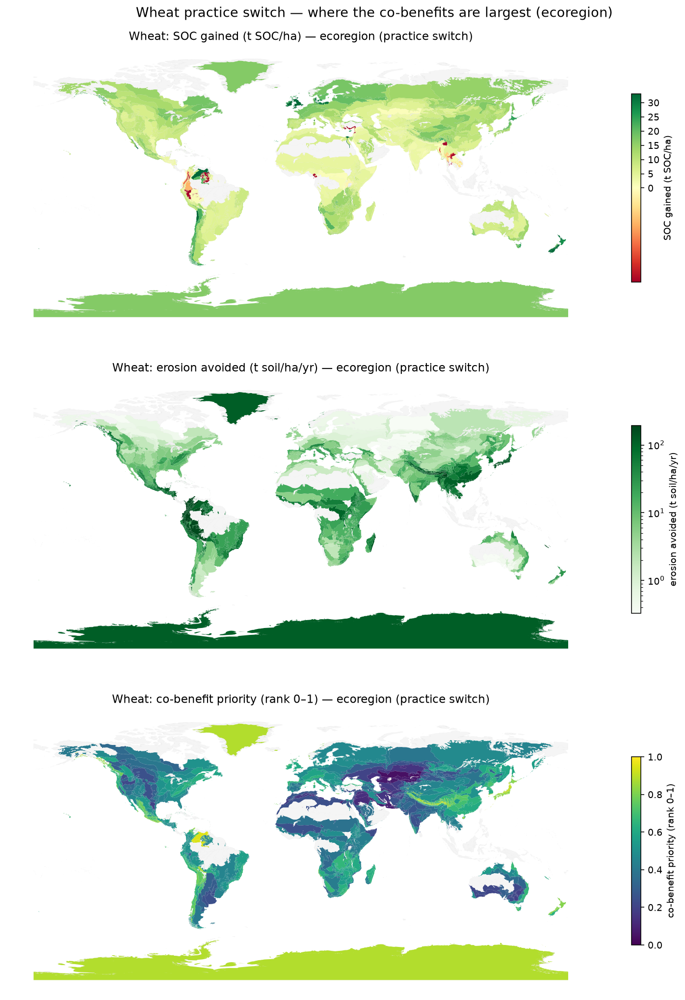
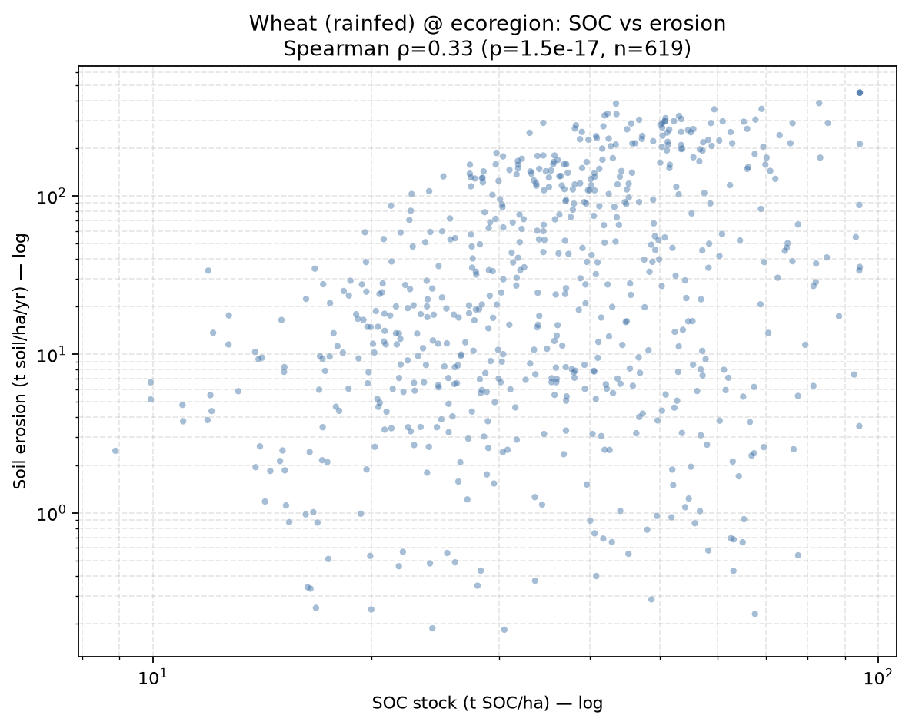

# Land Environmental Assessment Factors (LEAFs): A Plain-Language Guide

*A short overview for sustainability professionals and landowners — what LEAFs are, how they are
built, and how to use them. No modeling background required.*

---

## 1. The big idea: what a LEAF is

For most of the last decade, corporate environmental action has been dominated by climate. Carbon
accounting works well partly because of a simple trick: a ton of a greenhouse gas has the same
warming effect no matter where it is emitted, so one number (a characterization factor) can
describe it everywhere.

**Soil and land do not work that way.** The same crop, grown with the same practices, will affect
the soil very differently in Iowa than in Kenya — because slope, rainfall, temperature, and soil
type are all local. That local nature is exactly why land impacts have been so hard to put numbers
on, and why, of the five things a company can do to lower its footprint (use less, switch inputs,
switch technology, switch sourcing region, or **change production practices**), *changing
production practices* has always been the hardest to quantify.

A **Land Environmental Assessment Factor (LEAF)** is designed to close that gap. A LEAF answers a
deceptively simple question:

> *Given **where** a commodity is grown and **how** it is managed, what is the expected effect on a
> soil-quality indicator — and how does that compare to a safe operating threshold?*

LEAFs were developed for the **Science Based Targets Network (SBTN) Land v2** methods (Target 2:
Working Land Regeneration & Restoration), using only publicly available data. They cover three
soil-quality indicators:

| Indicator | What it measures (plainly) | Unit | How it's estimated |
|---|---|---|---|
| **Soil Organic Carbon (SOC)** | How much carbon the soil holds — a proxy for healthy, fertile, water-holding soil | tons C / hectare | RothC carbon model, projected to 2030 |
| **Soil Erosion** | How much topsoil is lost each year | tons soil / hectare / year | RUSLE erosion equation |
| **Terrestrial Acidification** | How damaging acidifying air emissions (e.g. ammonia) are to local soils | SO₂-equivalent / kg | Published factors (Roy et al., 2014) |

Crucially, each LEAF is built to be compared **directly against an ecoregional threshold** — a
science-based line describing "what nature needs to function" in that region. That comparison is
what turns a raw number into a decision.

---

## 2. How LEAFs are made (high level, no math)

Every indicator goes through the same four steps:

1. **Gather global data** — climate (NASA precipitation and temperature), soils (SoilGrids), crop
   yields (FAO), and land use. No single dataset covers everything, so many sources are combined.
2. **Harmonize onto one map** — all inputs are placed on a single common grid (~10 km cells) so
   they line up. This is the quiet, unglamorous step that makes everything else possible — and it
   lets results for *different* indicators be compared in the same place.
3. **Model the indicator** for every location **and** every management option.
4. **Aggregate into look-up tables** — the detailed maps are averaged up to **ecoregion, country,
   and sub-country** levels, so a user can simply look up a value instead of handling raw maps.

**Not every indicator needed the same effort** — and that was a deliberate choice:

- **SOC** is the heavy one. It uses a dynamic model (RothC) that simulates month-by-month carbon
  turnover in the soil, fed by a dozen inputs, and runs forward to 2030.
- **Soil Erosion** is in the middle. Because three of its five factors depend only on soil and
  weather (not the crop), they were pre-combined into one reusable base layer — turning a heavy
  computation into a light multiplication for each new crop or practice.
- **Acidification** is the light one. Solid peer-reviewed factors already existed, so no new
  modeling was done — only error-correction and re-gridding.

The guiding principle: *spend modeling effort where it changes a decision and where good factors
don't already exist.*

**One subtle but important point for users:** factors depend on the **combination** of practices,
not on each practice in isolation. Irrigation, residue management, and tillage interact with each
other and with the specific crop, so LEAFs are produced for full *scenarios* (e.g. "wheat,
rainfed, residues left, reduced tillage"). In total, roughly **110 commodity-and-practice
combinations** were generated for SOC and **106** for soil erosion, across 42 land-use classes.

**An honest word on limits.** Global coverage comes at a cost in local precision: these models are
built to work everywhere, which means they cannot capture every field-scale detail the way a local
model could. Ecoregional averages can be coarse where soil varies meter-to-meter, statistical
outliers are trimmed to keep regional averages sensible, and adding new crops or practices is a
large enough job that it is meant to be a **community effort**, not a one-time deliverable. LEAFs
are best understood as strong, science-based *decision support* — not a replacement for measuring
the ground directly where the stakes are high.

---

## 3. How to use LEAFs

### Setting a baseline and a target (SBTN Land v2, Target 2)

The core workflow is straightforward:

1. Identify the **commodity** you grow or source, your **management practices**, and the
   **ecoregion** where production happens.
2. **Look up the ecoregional LEAF** for that combination.
3. **Compare it to the ecoregional threshold.** Targets are set at a 10% "safe distance" from the
   threshold (10% above it for SOC, 10% below for erosion and acidification).
   - If your baseline or the ecoregion already crosses the line → you set an **improvement target**.
   - If neither does → you set a **maintenance target** to prevent future degradation.

The minimum traceability needed is the **ecoregion** your commodity comes from. Where supply
chains can't trace that far, ecoregional and gridded statistics can be combined with crop maps to
estimate a representative value.

### Testing "what if we changed practices?"

This is where LEAFs are most powerful for both companies and landowners. Because the factors are
built per scenario, you can **forecast the benefit of a practice change before doing it** — for
example switching from conventional tillage with residues removed, to reduced tillage with
residues left on the field — **without needing primary data from every plot.**

Even better, because SOC and erosion share the same underlying grid, you can find where a single
change delivers **co-benefits for both at once**.

*Estimated soil erosion for wheat under different management combinations, by ecoregion. Leaving
residues on the field and reducing tillage noticeably lowers erosion in the highest-risk areas.*

*Each point is a region. Moving to regenerative practices improves soil carbon **and** reduces
erosion together — and the size of the win varies by location, helping prioritize where to act
first.*

### For landowners specifically

You do **not** need GIS skills or detailed farm records to get started. With little more than your
**coordinates and commodity**, you can estimate the current status of your soil indicators and
compare the likely outcomes of different management options. A single-point version of the models
also exists for understanding one farm in detail, alongside the global version.

### Where to find LEAFs and what they look like

- **Ready-to-use tables**: CSV and geopackage files with ecoregion / country / sub-country
  averages live in the [`LEAFs/`](../LEAFs/) folder of this repository.
- **Full-resolution maps**: rasters at the original grid for users who want the detail.
- **API**: under development so software tools can integrate LEAFs directly.
- **Timeline**: SBTN Land v2 launches around **September 2026**, alongside the **AGILE** accounting
  guidance (SBTN's equivalent of the GHG Protocol) covering baselines, factor use, and how to
  bring in your own primary data.

### What LEAFs are *not*

SOC and soil-erosion LEAFs are **estimates of soil status** for a given place and practice — they
are not traditional life-cycle "impact scores" and should not be used as such. They are designed
to be compared to thresholds and to each other, to guide where and how to act.

---

## 4. Key takeaways

- **Location is everything.** Unlike carbon, land impacts depend on where production happens —
  LEAFs build that local reality into a single look-up number.
- **Practice change is now measurable.** The hardest corporate lever to quantify can finally be
  estimated, consistently, anywhere in the world.
- **Ready to use.** Ecoregional averages compare directly against SBTN thresholds, with no GIS
  required.
- **Co-benefits are visible.** Aligned SOC and erosion factors show where one practice change helps
  multiple indicators at once.
- **Extensible by the community.** The models are open and reproducible, so new commodities,
  practices, and better data can keep improving LEAFs over time.

---

### Want more detail?

- Method deep-dives in this repository:
  [SOC](SOC_Documentation.md) · [Soil Erosion](Soil_Erosion_Documentation.md) ·
  [Terrestrial Acidification](TerrAcidification_Documentation.md)
- [SBTN Land Accounting Guidelines (AGILE) — draft](https://sciencebasedtargetsnetwork.org/wp-content/uploads/2025/04/SBTN-Land-Accounting-Guidelines-Draft-for-Public-Consultation.pdf)
- [SBTN Step 3: Land Technical Guidance v2 — draft](https://sciencebasedtargetsnetwork.org/wp-content/uploads/2025/04/SBTN-Step-3-Land-Technical-Guidance-V2-DRAFT.pdf)
