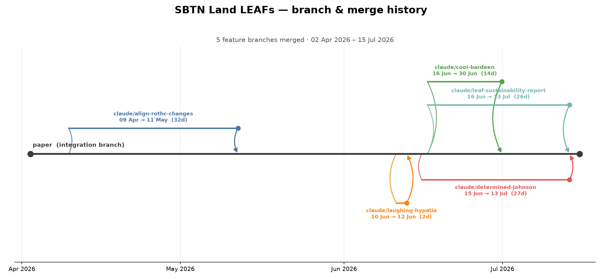
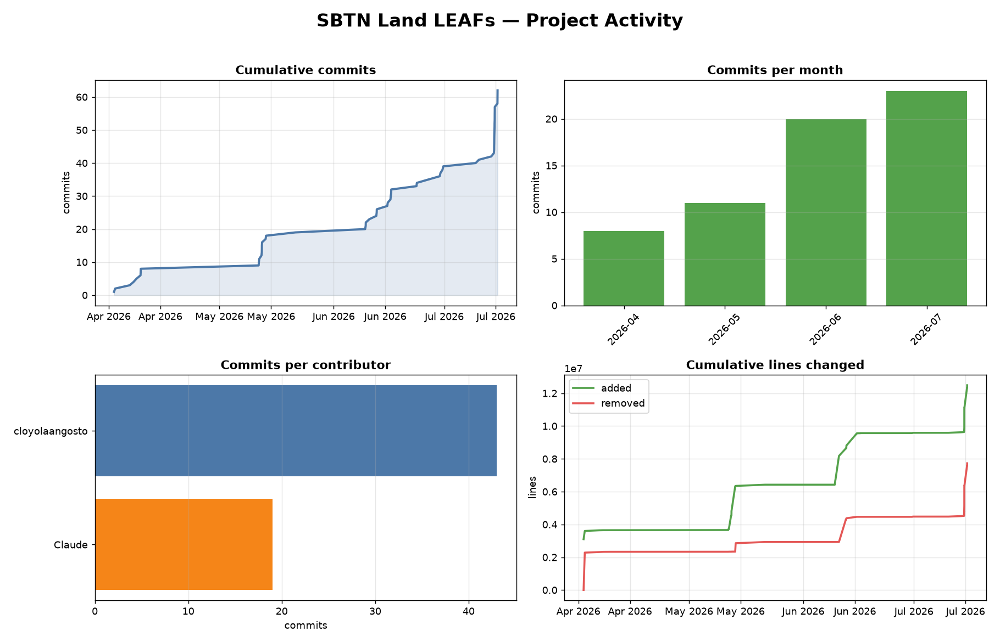

# Visualizing the project's history

Reproducible ways to show how this repository — and its branches — evolved
over the life of the project. All outputs land in
`documentation/figures/`.

## 1. Branch & merge topology (static image)

A clean "git graph" of the `paper` integration branch and every feature
branch that was merged into it, with each branch's lifespan.

```bash
python scripts/branch_graph.py
# -> documentation/figures/branch_topology.png
```



## 2. Activity dashboard + growth animation

`scripts/visualize_history.py` reads the full git history and produces:

- `activity_dashboard.png` — cumulative commits, commits per month, commits
  per contributor, and cumulative lines added/removed.
- `history.gif` — an animated, commit-by-commit timeline of the project
  growing (cumulative commits + distinct files touched), colour-coded by
  contributor.

```bash
pip install matplotlib pillow          # one-time
python scripts/visualize_history.py    # both outputs
python scripts/visualize_history.py --no-gif   # dashboard only
python scripts/visualize_history.py --fps 25   # smoother animation
```



## 3. Gource "growing file-tree" video (the showpiece)

[Gource](https://gource.io/) replays the whole history as an animated file
tree with contributors building the project in real time. It needs OpenGL, so
run it on a desktop machine rather than a headless container.

```bash
# macOS:   brew install gource ffmpeg
# Ubuntu:  sudo apt-get install gource ffmpeg
./scripts/gource_video.sh
# -> documentation/figures/gource.mp4
```

The script is a thin, tuned wrapper; open it to tweak speed, resolution, or
overlays.
